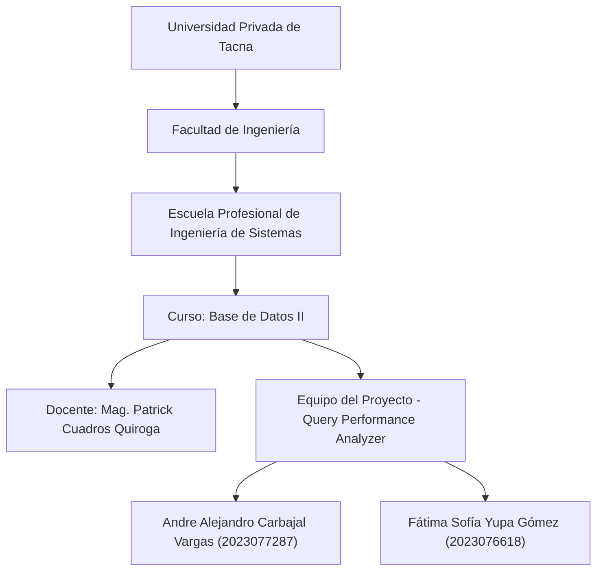
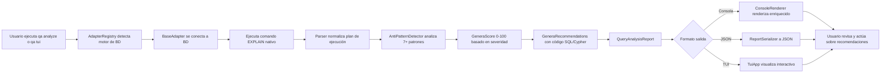
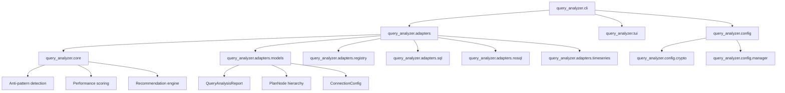
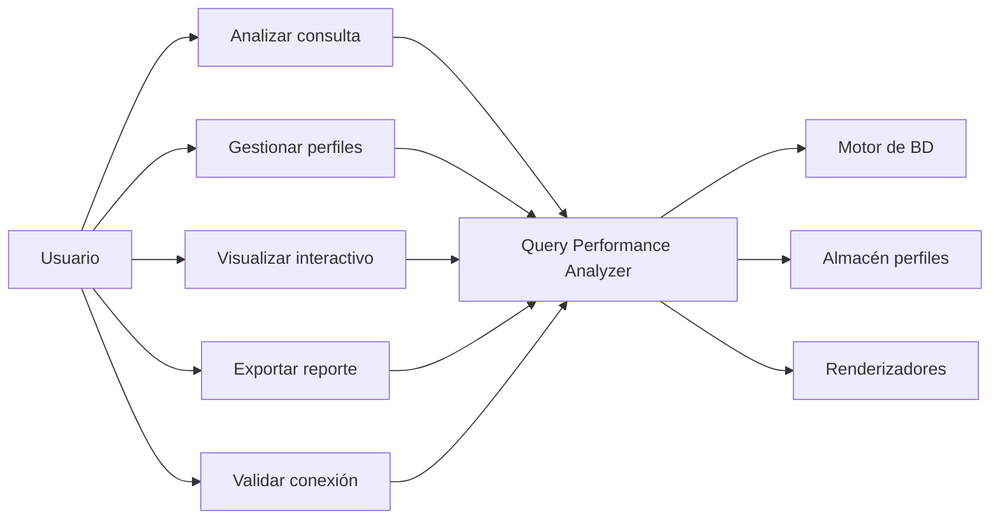
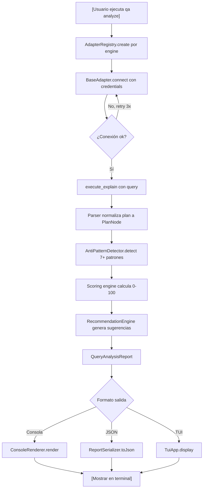
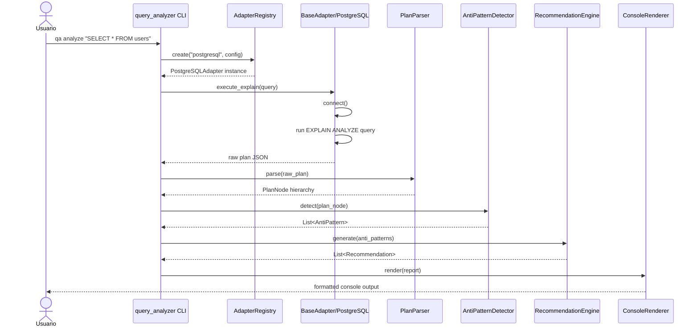

**UNIVERSIDAD PRIVADA DE TACNA**

**FACULTAD DE INGENIERÍA**

**Escuela Profesional de Ingeniería de Sistemas**

**Proyecto *Analizador de Rendimiento de Consultas***

Curso: *Base de Datos II*

Docente: *Mag. Patrick Cuadros Quiroga*

Integrantes:

***Carbajal Vargas, Andre Alejandro (2023077287)***

***Yupa Gómez, Fátima Sofía (2023076618)***

**Tacna - Perú**

***2026***

\pagebreak

Sistema *Query Performance Analyzer*

**Especificación de Requerimientos de Software**

**Versión *1.0***

| CONTROL DE VERSIONES |           |              |               |            |                                           |
|:--------------------:|:----------|:-------------|:--------------|:-----------|:------------------------------------------|
|       Versión        | Hecha por | Revisada por | Aprobada por  | Fecha      | Motivo                                    |
|         1.0          | ACV, FSY  | ACV, FSY     | P. Cuadros Q. | 2026-04-29 | Versión inicial del documento             |

\pagebreak

# ÍNDICE GENERAL

1. [Introducción](#1-introducción)
2. [Generalidades de la Empresa](#2-generalidades-de-la-empresa)
    - 2.1 [Nombre de la Empresa](#21-nombre-de-la-empresa)
    - 2.2 [Visión](#22-visión)
    - 2.3 [Misión](#23-misión)
    - 2.4 [Organigrama](#24-organigrama)
3. [Visionamiento de la Empresa](#3-visionamiento-de-la-empresa)
    - 3.1 [Descripción del problema](#31-descripción-del-problema)
    - 3.2 [Objetivo de Negocios](#32-objetivo-de-negocios)
    - 3.3 [Objetivo de diseño](#33-objetivo-de-diseño)
    - 3.4 [Alcance del proyecto](#34-alcance-del-proyecto)
    - 3.5 [Viabilidad del sistema](#35-viabilidad-del-sistema)
    - 3.6 [Información obtenida del levantamiento de información](#36-información-obtenida-del-levantamiento-de-información)
4. [Análisis de procesos](#4-análisis-de-procesos)
    - 4.1 [Diagrama de procesos actual](#41-diagrama-de-procesos-actual)
    - 4.2 [Diagrama de procesos propuesto](#42-diagrama-de-procesos-propuesto)
5. [Especificación de Requerimientos de Software](#5-especificación-de-requerimientos-de-software)
    - 5.1 [Cuadro de Requerimientos funcionales Inicial](#51-cuadro-de-requerimientos-funcionales-inicial)
    - 5.2 [Cuadro de Requerimientos no funcionales](#52-cuadro-de-requerimientos-no-funcionales)
    - 5.3 [Cuadro de Requerimientos funcionales Final](#53-cuadro-de-requerimientos-funcionales-final)
    - 5.4 [Reglas de Negocio](#54-reglas-de-negocio)
6. [Fase de Desarrollo](#6-fase-de-desarrollo)
    - 6.1 [Perfil del Usuario](#61-perfil-del-usuario)
    - 6.2 [Modelo Conceptual](#62-modelo-conceptual)
        - 6.2.1 [Diagrama de paquetes](#621-diagrama-de-paquetes)
        - 6.2.2 [Diagrama de casos de uso](#622-diagrama-de-casos-de-uso)
        - 6.2.3 [Escenarios de casos de uso (narrativas)](#623-escenarios-de-casos-de-uso-narrativas)
    - 6.3 [Modelo Lógico](#63-modelo-lógico)
        - 6.3.1 [Análisis de Objetos](#631-análisis-de-objetos)
        - 6.3.2 [Diagrama de Actividades](#632-diagrama-de-actividades)
        - 6.3.3 [Diagrama de secuencia](#633-diagrama-de-secuencia)
        - 6.3.4 [Diagrama de clases](#634-diagrama-de-clases)
7. [Conclusiones](#7-conclusiones)
8. [Recomendaciones](#8-recomendaciones)
9. [Bibliografía](#9-bibliografía)
10. [Webgrafía](#10-webgrafía)

\pagebreak

# 1. Introducción

El presente Informe de Especificación de Requerimientos de Software (ERS) define, de manera verificable, las capacidades funcionales y no funcionales del sistema *Query Performance Analyzer*. Este documento integra la visión académica del proyecto (FD02), la factibilidad evaluada (FD01) y el estado actual del código fuente para asegurar trazabilidad real entre requisitos, implementación y pruebas.

El sistema está orientado a analizar planes de ejecución en 13+ motores de bases de datos (PostgreSQL, MySQL, MongoDB, DynamoDB, Redis, Elasticsearch, Neo4j, InfluxDB, Cassandra, CockroachDB, YugabyteDB, SQLite, SQL Server), detectar anti-patrones de rendimiento automáticamente, generar puntuaciones objetivas (0-100) y brindar recomendaciones accionables con código concreto, todo mediante interfaz CLI y TUI interactiva.

# 2. Generalidades de la Empresa

## 2.1 Nombre de la empresa

Universidad Privada de Tacna – Facultad de Ingeniería – Escuela Profesional de Ingeniería de Sistemas.

## 2.2 Visión

Formar profesionales líderes, innovadores y comprometidos con la calidad, capaces de desarrollar soluciones tecnológicas aplicadas a problemas reales del entorno, con énfasis en bases de datos, optimización y gestión de sistemas distribuidos.

## 2.3 Misión

Brindar formación integral en ingeniería de software y bases de datos, promoviendo investigación aplicada, ética profesional y producción de software de calidad con impacto académico, empresarial y social.

## 2.4 Organigrama

\pagebreak

# 3. Visionamiento de la Empresa

## 3.1 Descripción del problema

En entornos modernos de desarrollo con múltiples motores de bases de datos (SQL, NoSQL, grafos, series de tiempo), la optimización de consultas lentas es crítica pero compleja. Cada motor expone planes de ejecución en formatos distintos, sin herramientas académicas accesibles que unifiquen el análisis. Los desarrolladores carecen de:

- **Visibilidad normalizada** del rendimiento de consultas en diferentes motores.
- **Detección automática** de anti-patrones conocidos (full table scans, nested loops, índices subóptimos).
- **Criterios objetivos** para priorizar optimizaciones.
- **Recomendaciones accionables** con código concreto listo para aplicar.

Esta falta de herramientas integradas causa deuda técnica de rendimiento, downtime en producción y oportunidades perdidas de aprendizaje en contextos académicos.

## 3.2 Objetivo de negocios

Reducir tiempo de diagnóstico de consultas problemáticas en múltiples motores de bases de datos, proporcionando herramienta CLI/TUI que entregue evidencia rápida, trazable y accionable para optimización y toma de decisiones técnicas.

## 3.3 Objetivo de diseño

Diseñar una solución modular en Python que:

- detecte automáticamente el motor de base de datos,
- ejecute el análisis de plan de ejecución nativo (EXPLAIN equivalent),
- parsee y normalice planes en representación común,
- detecte 7+ anti-patrones automáticamente por motor,
- genere puntuación de rendimiento (0-100) objetiva,
- emita recomendaciones priorizadas con código SQL/Cypher/agregación,
- presente resultados en consola enriquecida y JSON,
- y habilite flujo interactivo con TUI para análisis iterativo.

## 3.4 Alcance del proyecto

**Incluido en la versión actual:**

- Conexión a 13+ motores de bases de datos (SQL, NoSQL, TimeSeries).
- Ejecución de comando EXPLAIN / equivalente en cada motor.
- Parseo normalizado de planes de ejecución.
- Detección automática de 7+ anti-patrones comunes + especializados por motor (DynamoDB: 8 patrones, Cassandra: patrones específicos).
- Generación de puntuación de rendimiento (0-100) con criterio objetivo.
- Clasificación de hallazgos por severidad y tipo.
- Interfaz CLI con comandos `qa analyze`, `qa profile`, `qa tui`.
- Interfaz TUI interactiva con visualización de resultados y navegación.
- Exportación de reportes en JSON para automatización.
- Gestión de perfiles de conexión con encriptación de credenciales.

**Fuera de alcance en la versión actual:**

- Interfaz gráfica web o GUI de escritorio nativa.
- Aplicación automática de optimizaciones en el servidor de BD.
- Reemplazo total de herramientas de profiling empresariales (APM).
- Machine learning para predicción de problemas de rendimiento.
- Histórico temporal de cambios de rendimiento.

## 3.5 Viabilidad del sistema

Con base en FD01, la viabilidad del sistema es **alta** en todas dimensiones:

- **Técnica:** Stack Python 3.14+ es maduro y estable; drivers BD están disponibles; arquitectura modular de adapters es probada.
- **Operativa:** Ejecución local sin infraestructura compleja; instalación por PyPI.
- **Legal:** Licencia de código abierto (MIT); atribución clara de dependencias.
- **Social:** Impacto educativo en enseñanza de optimización de BD; reutilización en cursos posteriores.
- **Ambiental:** Consumo local de recursos mínimo; no requiere servidores dedicados.

Costo académico bajo, stack open-source documentado, metodología ágil.

## 3.6 Información obtenida del levantamiento de información

Fuentes de entrada para este ERS:

- Documento de factibilidad: `docs/FD01-Informe-Factibilidad.md`.
- Documento de visión: `docs/FD02-Informe-Vision.md`.
- Código fuente del sistema: módulos `adapters/`, `core/`, `config/`, `cli/`, `tui/`, `tests/`.
- README.md y workflows de desarrollo.
- Resultados de pruebas unitarias e integración.

\pagebreak

# 4. Análisis de procesos

## 4.1 Diagrama de procesos actual

Proceso manual sin herramienta unificada.

```mermaid
flowchart LR
    A["Desarrollador identifica consulta lenta"] --> B["Conecta manualmente a BD"]
    B --> C["Ejecuta EXPLAIN nativo del motor"]
    C --> D["Interpreta plan en formato propietario"]
    D --> E["Busca anti-patrones manualmente"]
    E --> F["Consulta documentación de índices"]
    F --> G["Sintetiza recomendación sin sistematización"]
    G --> H["Aplica cambio sin validación previa"]
```

## 4.2 Diagrama de procesos propuesto

Proceso automatizado con Query Performance Analyzer.

\pagebreak

# 5. Especificación de Requerimientos de Software

## 5.1 Cuadro de requerimientos funcionales inicial

| ID     | Requerimiento funcional inicial   | Criterio general de aceptación                                        |
|--------|-----------------------------------|-----------------------------------------------------------------------|
| RFI-01 | Conectar a múltiples motores de BD | Soporta PostgreSQL, MySQL, MongoDB, DynamoDB y 9 motores más          |
| RFI-02 | Ejecutar EXPLAIN en motor nativo   | Obtiene plan de ejecución según sintaxis del motor                    |
| RFI-03 | Parsear plan de ejecución          | Normaliza plan a estructura jerárquica común                          |
| RFI-04 | Detectar anti-patrones             | Identifica 7+ patrones conocidos de rendimiento subóptimo             |
| RFI-05 | Generar puntuación de rendimiento  | Produce score 0-100 basado en severidad de anti-patrones              |
| RFI-06 | Generar recomendaciones            | Sugiere acciones concretas con código SQL/Cypher/agregación           |
| RFI-07 | Mostrar resultados por consola     | Presenta reporte enriquecido (colores, tablas, estructura clara)      |
| RFI-08 | Exportar JSON                      | Genera reporte estructurado para automatización y análisis posterior   |

## 5.2 Cuadro de requerimientos no funcionales

| ID     | Requerimiento no funcional | Métrica / Umbral                                               | Evidencia esperada                                           |
|--------|----------------------------|----------------------------------------------------------------|--------------------------------------------------------------|
| RNF-01 | Portabilidad               | Ejecución en Windows, Linux y macOS                            | Instalación por PyPI; testing multi-SO                       |
| RNF-02 | Usabilidad técnica         | Comandos con ayuda y flags consistentes                        | `--help`, documentación clara en README                      |
| RNF-03 | Confiabilidad              | Manejo controlado de errores de conexión/parseo/timeout        | No abortar flujo por fallo parcial; mensajes informativos    |
| RNF-04 | Seguridad de credenciales  | Encriptación de contraseñas en perfiles guardados              | Archivos `.config/` encriptados; no exposición en logs       |
| RNF-05 | Interoperabilidad          | JSON válido, estable y documentado                             | `--output json` parseable por jq y scripts externos          |
| RNF-06 | Rendimiento                | Análisis simple <= 10s, complejo <= 30s en entorno local       | Mediciones de referencia y pruebas de carga                  |
| RNF-07 | Mantenibilidad             | Arquitectura modular con patrón Adapter                        | Agregar nuevo motor sin modificar código existente            |
| RNF-08 | Auditabilidad              | Evidencia reproducible en CI/CD                                | Workflows de test y release definidos en GitHub Actions      |

## 5.3 Cuadro de requerimientos funcionales final

| ID    | Requerimiento funcional final                                                        | Prioridad | Trazabilidad técnica (módulo/código)                                               |
|-------|--------------------------------------------------------------------------------------|-----------|------------------------------------------------------------------------------------|
| RF-01 | Detectar automáticamente motor de BD en ruta de proyecto                             | Alta      | `query_analyzer/adapters/registry.py`, `AdapterRegistry.create()`                  |
| RF-02 | Conectar de forma segura a motor de BD con perfil de conexión                        | Alta      | `query_analyzer/config/manager.py`, `ConnectionConfig` encriptado                  |
| RF-03 | Ejecutar comando EXPLAIN/equivalente en motor nativo                                 | Alta      | `query_analyzer/adapters/base.py`, `BaseAdapter.execute_explain()`                |
| RF-04 | Parsear plan de ejecución según formato nativo del motor                            | Alta      | Parsers en `query_analyzer/adapters/sql/*`, `nosql/*`, `timeseries/*`              |
| RF-05 | Normalizar plan a estructura jerárquica común (PlanNode)                             | Alta      | `query_analyzer/adapters/models.py`, `PlanNode` class                              |
| RF-06 | Detectar anti-patrones comunes (7+)                                                 | Alta      | `query_analyzer/core/anti_pattern_detector.py`                                     |
| RF-07 | Detectar anti-patrones especializados por motor                                     | Alta      | `query_analyzer/core/dynamodb_anti_pattern_detector.py`, `cassandra_*`             |
| RF-08 | Generar puntuación de rendimiento (0-100) con lógica objetiva                       | Alta      | Cálculo en `AntiPatternDetector`, scoring en `QueryAnalysisReport.score`            |
| RF-09 | Generar recomendaciones priorizadas (1-10) con código SQL/Cypher                    | Alta      | `Recommendation` en models, códigos por motor en adapters                          |
| RF-10 | Presentar resultados en consola con formato enriquecido (colores, tablas)           | Alta      | `query_analyzer/cli/commands/`, Rich formatting en renderers                       |
| RF-11 | Exportar resultados completos a JSON estructurado                                   | Alta      | `query_analyzer/adapters/serializer.py`, opción `--output json`                    |
| RF-12 | Exportar resultados a Markdown para reportes                                        | Media     | Markdown serializer en report generators                                           |
| RF-13 | Proporcionar interfaz TUI interactiva para análisis iterativo                       | Media     | `query_analyzer/tui/app.py`, screens y widgets con Textual                         |
| RF-14 | Gestionar perfiles de conexión de forma segura (agregar, listar, eliminar)          | Alta      | `query_analyzer/cli/commands/profile.py`, `ConfigManager`                          |
| RF-15 | Encriptar credenciales en perfiles guardados locales                                | Alta      | `query_analyzer/config/crypto.py`, AES encryption                                  |
| RF-16 | Soportar entrada de consulta por CLI directa, archivo, stdin o editor interactivo   | Media     | CLI `--query`, `--file`, stdin en `query_analyzer/cli/commands/analyze.py`          |
| RF-17 | Validar conexión antes de análisis (test connection)                                | Media     | `qa profile test <name>` command                                                    |

## 5.4 Reglas de Negocio

| ID    | Regla de negocio                                                                                    | Aplicación                                     |
|-------|-----------------------------------------------------------------------------------------------------|------------------------------------------------|
| RN-01 | El análisis es read-only; no se modifica la BD bajo ninguna circunstancia                           | Flag read-only en todas las conexiones        |
| RN-02 | En caso de error de conexión, el sistema intenta reconectar hasta 3 veces antes de fallar          | Retry logic en `BaseAdapter.execute_explain()` |
| RN-03 | En caso de timeout de consulta EXPLAIN, se reporta con degradación controlada (plan parcial)       | Timeout handler en adapters                   |
| RN-04 | Las credenciales se validan antes de guardar en perfil (test connection implícito)                  | `ConfigManager.validate_and_save()`           |
| RN-05 | El score de rendimiento es determinístico para misma consulta y plan en mismo motor               | Lógica de scoring consistente en detector     |
| RN-06 | Las recomendaciones se prorizan por impacto estimado (1=máximo impacto, 10=sugerencia)             | Prioritization logic en RecommendationEngine  |
| RN-07 | El modo TUI fuerza actualización dinámica del análisis en cada navegación                          | TUI app state management                      |
| RN-08 | Los perfiles son específicos por motor de BD; no se comparten credenciales entre motores            | Perfil = (motor_type, host, credentials)     |

\pagebreak

# 6. Fase de Desarrollo

## 6.1 Perfil del usuario

| Perfil                      | Características                           | Necesidades principales                       | Escenario típico                                 |
|-----------------------------|-------------------------------------------|-----------------------------------------------|--------------------------------------------------|
| Usuario técnico básico      | Usa terminal para comandos directos       | Diagnóstico rápido en consola                 | `qa analyze "SELECT ..."` sobre consulta lenta  |
| Usuario técnico intermedio  | Integra herramientas con scripts          | Salida JSON y parámetros de control           | `qa analyze --file query.sql --output json`     |
| Usuario técnico avanzado/CI | Automatiza control de calidad              | Exit code controlado, reportes estables       | Integración en GitHub Actions/GitLab CI         |
| Desarrollador de adapters   | Extiende soporta de nuevos motores        | Interfaz BaseAdapter clara, tests de ejemplo  | Implementar `PostgreSQLAdapter` para nuevo motor |
| Mantenedor académico        | Evalúa trazabilidad y evidencia           | Coherencia entre FD01/FD02/FD03 y código      | Revisión de código, pruebas y documentación      |

## 6.2 Modelo Conceptual

### 6.2.1 Diagrama de paquetes

### 6.2.2 Diagrama de casos de uso

### 6.2.3 Escenarios de casos de uso (narrativas)

| Caso de uso                   | Actor   | Flujo principal                                                                                | Resultado                                           |
|-------------------------------|---------|------------------------------------------------------------------------------------------------|-----------------------------------------------------|
| CU-01 Analizar consulta       | Usuario | Ejecuta `qa analyze "SELECT ..."` con motor especificado o detectado automáticamente            | Reporte en consola con score y recomendaciones     |
| CU-02 Gestionar perfiles      | Usuario | Ejecuta `qa profile add` para guardar credenciales de BD; `qa profile list` para ver guardados | Perfil encriptado guardado en `~/.qa/config`       |
| CU-03 Validar conexión        | Usuario | Ejecuta `qa profile test <profile-name>` para verificar credenciales antes de análisis         | "Connection successful" o error detallado          |
| CU-04 Análisis con TUI        | Usuario | Ejecuta `qa tui`; carga perfil; ingresa consulta; navega resultados interactivamente           | Visualización enriquecida con panels y navegación  |
| CU-05 Exportar reporte JSON   | Usuario | Ejecuta `qa analyze --file query.sql --output json > report.json`                              | JSON estructurado listo para CI/CD o análisis      |
| CU-06 Análisis por motor      | Usuario | Especifica `--engine postgresql` o auto-detecta por contexto de archivo                        | Análisis con parser y recomendaciones del motor    |
| CU-07 Consulta desde stdin    | Usuario | Ejecuta `cat query.sql \| qa analyze --engine mysql`                                           | Análisis desde pipe de shell                       |

\pagebreak

## 6.3 Modelo Lógico

### 6.3.1 Análisis de objetos

| Objeto                                            | Responsabilidad                                                  | Tipo                         |
|---------------------------------------------------|------------------------------------------------------------------|------------------------------|
| `AdapterRegistry`                                 | Factory para crear y registrar adaptadores por motor              | Factory pattern              |
| `BaseAdapter`                                     | Interfaz común para todos los adaptadores de BD                  | Abstract base class          |
| `PostgreSQLAdapter`, `MySQLAdapter`, etc.         | Implementación específica de adapter para cada motor              | Concrete adapter             |
| `AntiPatternDetector`                             | Detectar 7+ anti-patrones comunes en planes de ejecución         | Service/detector             |
| `DynamoDBAntiPatternDetector`                     | Detectar 8 anti-patrones específicos para DynamoDB               | Specialized detector         |
| `QueryAnalysisReport`                             | Representar resultado consolidado de análisis                    | DTO/domain model             |
| `PlanNode`                                        | Nodo jerárquico de plan de ejecución normalizado                 | Domain entity                |
| `Recommendation`                                  | Sugerencia accionable con código SQL/Cypher/agregación           | Domain entity                |
| `ConsoleRenderer`                                 | Transformar reporte a salida enriquecida en terminal             | Presenter                    |
| `ReportSerializer`                                | Transformar reporte a JSON o Markdown                            | Serializer                   |
| `TuiApp`                                          | Aplicación interactiva con Textual para visualización            | TUI controller               |
| `ConfigManager`                                   | Gestionar perfiles de conexión encriptados                       | Configuration service       |
| `ConnectionConfig`                                | Datos de conexión (host, puerto, DB, usuario, contraseña cifrada)| Configuration entity        |

### 6.3.2 Diagrama de Actividades

### 6.3.3 Diagrama de secuencia

### 6.3.4 Diagrama de clases

```mermaid
classDiagram
    class BaseAdapter {
        <<abstract>>
        #config: ConnectionConfig
        #connect(): void
        #disconnect(): void
        +execute_explain(query: str): QueryAnalysisReport
    }
    
    class PostgreSQLAdapter {
        +execute_explain(query: str): QueryAnalysisReport
    }
    
    class MySQLAdapter {
        +execute_explain(query: str): QueryAnalysisReport
    }
    
    class MongoDBAdapter {
        +execute_explain(query: str): QueryAnalysisReport
    }
    
    class DynamoDBAdapter {
        +execute_explain(query: str): QueryAnalysisReport
    }
    
    class AdapterRegistry {
        -adapters: Dict
        +register(engine: str, adapter_class: Type)$
        +create(engine: str, config: ConnectionConfig)$: BaseAdapter
    }
    
    class QueryAnalysisReport {
        +engine: str
        +query: str
        +score: int
        +execution_time_ms: float
        +plan_tree: PlanNode
        +warnings: List~Warning~
        +recommendations: List~Recommendation~
        +analyzed_at: datetime
    }
    
    class PlanNode {
        +node_type: str
        +cost: float
        +estimated_rows: int
        +actual_rows: int
        +properties: Dict
        +children: List~PlanNode~
    }
    
    class AntiPattern {
        +id: str
        +severity: str
        +message: str
        +affected_object: str
        +metadata: Dict
    }
    
    class Recommendation {
        +priority: int
        +title: str
        +description: str
        +code_snippet: str
        +affected_object: str
    }
    
    class AntiPatternDetector {
        +detect(plan: PlanNode): List~AntiPattern~
    }
    
    class DynamoDBAntiPatternDetector {
        +detect(plan: PlanNode): List~AntiPattern~
    }
    
    class ConsoleRenderer {
        +render(report: QueryAnalysisReport): str
    }
    
    class ReportSerializer {
        +to_json(report: QueryAnalysisReport): str
        +to_markdown(report: QueryAnalysisReport): str
    }
    
    class ConfigManager {
        +add_profile(name: str, config: ConnectionConfig): void
        +list_profiles(): List~str~
        +get_profile(name: str): ConnectionConfig
        +test_connection(name: str): bool
    }
    
    class ConnectionConfig {
        +engine: str
        +host: str
        +port: int
        +database: str
        +username: str
        +password: str
    }
    
    BaseAdapter <|-- PostgreSQLAdapter
    BaseAdapter <|-- MySQLAdapter
    BaseAdapter <|-- MongoDBAdapter
    BaseAdapter <|-- DynamoDBAdapter
    
    AdapterRegistry --> BaseAdapter
    BaseAdapter --> QueryAnalysisReport
    QueryAnalysisReport --> PlanNode
    QueryAnalysisReport --> AntiPattern
    QueryAnalysisReport --> Recommendation
    
    AntiPatternDetector --> AntiPattern
    DynamoDBAntiPatternDetector --> AntiPattern
    
    ConsoleRenderer --> QueryAnalysisReport
    ReportSerializer --> QueryAnalysisReport
    
    ConfigManager --> ConnectionConfig
    BaseAdapter --> ConnectionConfig
```

\pagebreak

# 7. Conclusiones

1. El ERS define requerimientos verificables y trazables al código real del proyecto, reduciendo ambigüedad documental entre FD01, FD02 y especificación técnica.

2. El núcleo funcional del sistema cumple el objetivo académico: análisis integral de rendimiento de consultas en 13+ motores de BD, con detección automática de anti-patrones y scoring objetivo (0-100).

3. La arquitectura modular mediante patrón Adapter facilita agregar nuevos motores sin modificación de código existente, asegurando mantenibilidad y escalabilidad.

4. Los requisitos no funcionales priorizan portabilidad (Windows/Linux/macOS), seguridad (encriptación de credenciales), interoperabilidad (JSON) y confiabilidad (manejo de errores degradado).

5. El modelo conceptual (casos de uso) y lógico (diagramas UML) proporciona blueprint para implementación, pruebas y validación docente.

6. Las reglas de negocio aseguran operación segura (read-only), confiable (retry, timeout) y auditable (reproducibilidad en CI/CD).

\pagebreak

# 8. Recomendaciones

1. Mantener sincronizados FD01, FD02, FD03 y README.md al cerrar cada sprint o hito académico para asegurar coherencia documental.

2. Agregar una matriz formal Requisito (RF-XX/RNF-XX) → Módulo código → Prueba automatizada para evaluación docente y auditoría de trazabilidad.

3. Establecer línea base de rendimiento por tipo de motor (tiempo de análisis simple vs complejo) para detectar regresiones.

4. Fortalecer pruebas de escenarios no estándar: timeouts largos, BD inaccesibles, versiones de motor desconocidas, entornos con proxies.

5. Definir en siguiente iteración un histórico comparativo entre ejecuciones (`qa analyze --compare previous.json`) para seguimiento temporal de optimizaciones.

6. Documentar en README el flujo de extensión para agregar un nuevo motor (ej: crear `CustomDBAdapter`, registrarse en `AdapterRegistry`, pruebas obligatorias).

\pagebreak

# 9. Bibliografía

1. Pressman, R. S., & Maxim, B. R. (2020). *Software Engineering: A Practitioner's Approach* (10th ed.). McGraw-Hill Education.

2. Sommerville, I. (2016). *Software Engineering* (10th ed.). Pearson.

3. ISO/IEC 25010:2011. *Systems and software quality models*. International Organization for Standardization.

4. Kleppmann, M. (2017). *Designing Data-Intensive Applications: The Big Ideas Behind Reliable, Scalable, and Maintainable Systems*. O'Reilly Media.

5. Garcia-Molina, H., Ullman, J. D., & Widom, J. (2009). *Database Systems: The Complete Book* (2nd ed.). Prentice Hall.

6. PostgreSQL Global Development Group. (2026). *PostgreSQL Documentation: EXPLAIN*.

7. Oracle Corporation. (2026). *MySQL 8.0 Reference Manual: EXPLAIN Output Format*.

8. MongoDB, Inc. (2026). *MongoDB Manual: Aggregation Pipeline Explain Output*.

9. Amazon Web Services. (2026). *AWS DynamoDB Developer Guide: Query Performance*.

10. The Elasticsearch Company. (2026). *Elasticsearch Documentation: Profiling and Performance*.

11. Neo4j, Inc. (2026). *Neo4j Cypher Manual: EXPLAIN and PROFILE*.

12. Python Software Foundation. (2026). *Python 3.14 Documentation*.

13. Tiobe. (2026). *Tiobe Index: Python and Multi-paradigm Languages*.

\pagebreak

# 10. Webgrafía

**Repositorio del proyecto:**
- GitHub: [Query Performance Analyzer](https://github.com/estudiantes/query-performance-analyzer)
- README: [README.md](../../README.md)
- Documento de factibilidad: [FD01-Informe-Factibilidad.md](./FD01-Informe-Factibilidad.md)
- Documento de visión: [FD02-Informe-Vision.md](./FD02-Informe-Vision.md)

**Código fuente:**
- CLI principal: [query_analyzer/cli/main.py](../../query_analyzer/cli/main.py)
- Comando analizar: [query_analyzer/cli/commands/analyze.py](../../query_analyzer/cli/commands/analyze.py)
- Comando perfil: [query_analyzer/cli/commands/profile.py](../../query_analyzer/cli/commands/profile.py)
- Registro de adaptadores: [query_analyzer/adapters/registry.py](../../query_analyzer/adapters/registry.py)
- Interfaz base: [query_analyzer/adapters/base.py](../../query_analyzer/adapters/base.py)
- Detector de anti-patrones: [query_analyzer/core/anti_pattern_detector.py](../../query_analyzer/core/anti_pattern_detector.py)
- TUI: [query_analyzer/tui/app.py](../../query_analyzer/tui/app.py)
- Configuración: [query_analyzer/config/manager.py](../../query_analyzer/config/manager.py)
- Encriptación: [query_analyzer/config/crypto.py](../../query_analyzer/config/crypto.py)

**Documentación oficial:**
- https://www.python.org/doc/
- https://typer.tiangolo.com/ (CLI framework)
- https://textual.textualize.io/ (TUI framework)
- https://docs.pydantic.dev/latest/ (data validation)
- https://rich.readthedocs.io/ (console formatting)
- https://www.postgresql.org/docs/
- https://dev.mysql.com/doc/
- https://docs.mongodb.com/
- https://docs.aws.amazon.com/dynamodb/
- https://www.elastic.co/guide/en/elasticsearch/reference/current/
- https://neo4j.com/docs/
- https://docs.redis.com/
- https://cassandra.apache.org/doc/
- https://github.com/ (Git y GitHub Actions)

\pagebreak

