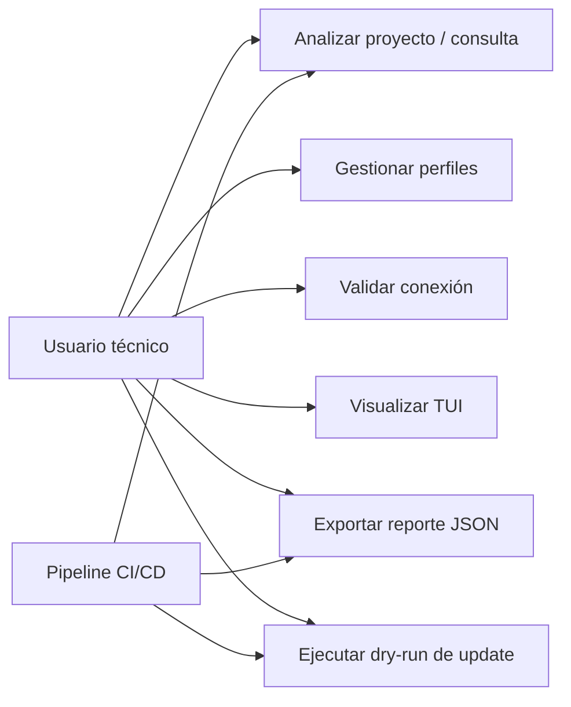
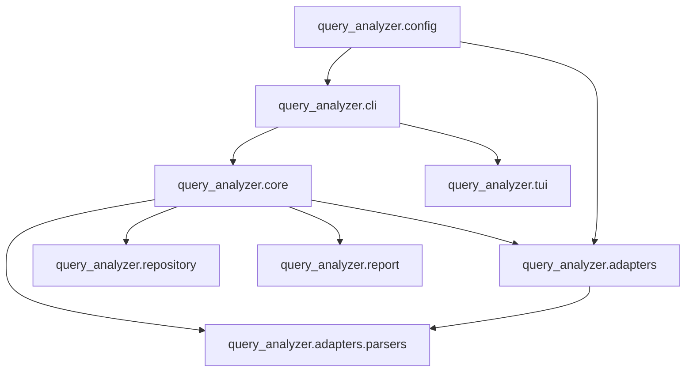
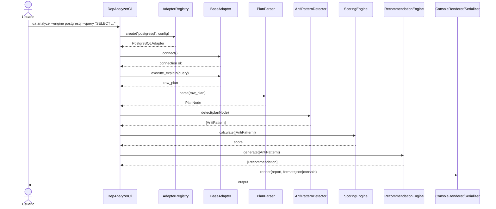
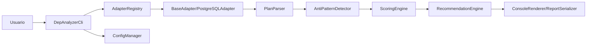
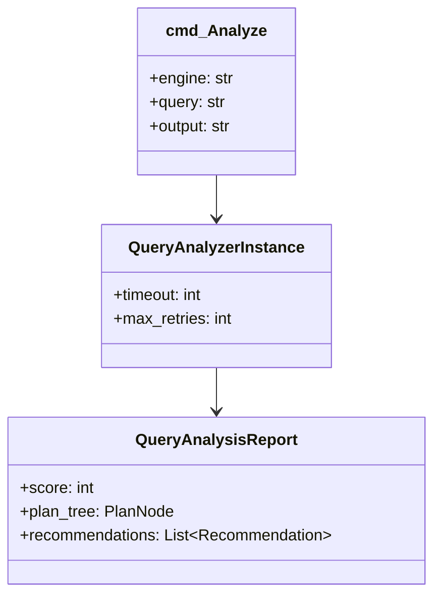
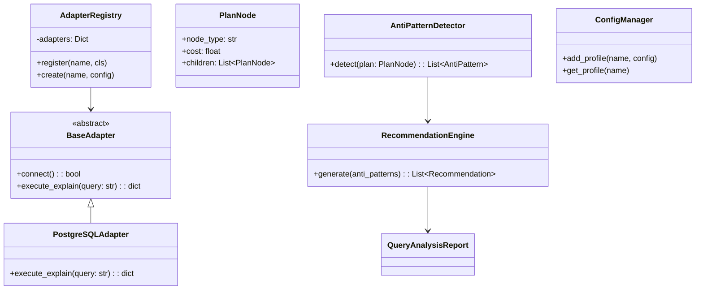
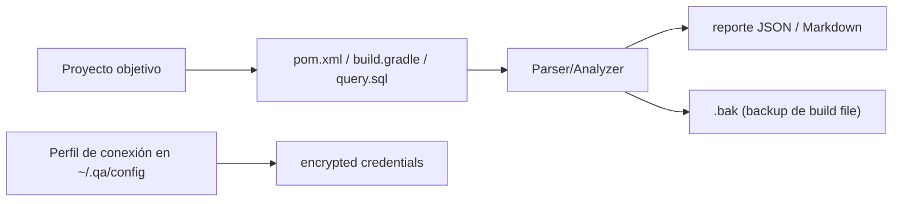
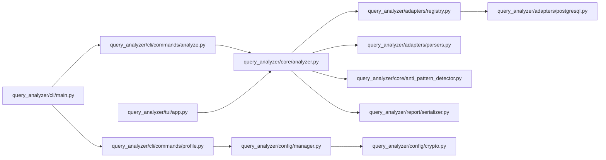
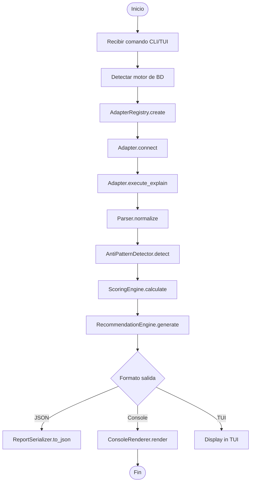

<center>


**UNIVERSIDAD PRIVADA DE TACNA**

**FACULTAD DE INGENIERÍA**

**Escuela Profesional de Ingeniería de Sistemas**

**Proyecto *Query Performance Analyzer***

Curso: *Base de Datos II*

Docente: *Mag. Patrick Cuadros Quiroga*

Integrantes:

***Carbajal Vargas, Andre Alejandro (2023077287)***

***Yupa Gómez, Fátima Sofía (2023076618)***

**Tacna - Perú**

***2026***

</center>

<div style="page-break-after: always; visibility: hidden">\pagebreak</div>

Sistema *Query Performance Analyzer*

**Informe de Arquitectura de Software**

**Versión *1.0***

| CONTROL DE VERSIONES |           |              |               |            |                                           |
|:--------------------:|:----------|:-------------|:--------------|:-----------|:------------------------------------------|
|       Versión        | Hecha por | Revisada por | Aprobada por  | Fecha      | Motivo                                    |
|         1.0          | ACV, FSY  | ACV, FSY     | P. Cuadros Q. | 2026-04-29 | Versión inicial del documento             |

<div style="page-break-after: always; visibility: hidden">\pagebreak</div>

# ÍNDICE GENERAL

1. [Introducción](#1-introducción)
    1. [Propósito (Diagrama 4+1)](#11-propósito-diagrama-41)
    2. [Alcance](#12-alcance)
    3. [Definiciones, siglas y abreviaturas](#13-definiciones-siglas-y-abreviaturas)
    4. [Organización del documento](#14-organización-del-documento)
2. [Objetivos y restricciones arquitectónicas](#2-objetivos-y-restricciones-arquitectónicas)
    1. [Priorización de requerimientos](#21-priorización-de-requerimientos)
        1. [Requerimientos funcionales](#211-requerimientos-funcionales)
        2. [Requerimientos no funcionales](#212-requerimientos-no-funcionales)
    2. [Restricciones arquitectónicas](#22-restricciones-arquitectónicas)
3. [Representación de la arquitectura del sistema (Vista 4+1)](#3-representación-de-la-arquitectura-del-sistema)
    1. [Vista de uso](#31-vista-de-uso)
        1. [Diagrama de casos de uso](#311-diagrama-de-casos-de-uso)
    2. [Vista lógica](#32-vista-lógica)
        1. [Diagrama de sub-sistemas (paquetes)](#321-diagrama-de-sub-sistemas-paquetes)
        2. [Diagrama de secuencia (vista de diseño)](#322-diagrama-de-secuencia-vista-de-diseño)
        3. [Diagrama de colaboración (vista de diseño)](#323-diagrama-de-colaboración-vista-de-diseño)
        4. [Diagrama de objetos](#324-diagrama-de-objetos)
        5. [Diagrama de clases](#325-diagrama-de-clases)
        6. [Diagrama de persistencia / archivos](#326-diagrama-de-persistencia)
    3. [Vista de implementación (vista de desarrollo)](#33-vista-de-implementación-vista-de-desarrollo)
        1. [Diagrama de arquitectura de software](#331-diagrama-de-arquitectura-de-software)
        2. [Diagrama de componentes](#332-diagrama-de-componentes)
    4. [Vista de procesos](#34-vista-de-procesos)
        1. [Diagrama de actividades (procesos)](#341-diagrama-de-actividades)
    5. [Vista de despliegue](#35-vista-de-despliegue)
        1. [Diagrama de despliegue](#351-diagrama-de-despliegue)
4. [Atributos de calidad del software](#4-atributos-de-calidad-del-software)
    1. [Escenario de funcionalidad](#41-escenario-de-funcionalidad)
    2. [Escenario de usabilidad](#42-escenario-de-usabilidad)
    3. [Escenario de confiabilidad](#43-escenario-de-confiabilidad)
    4. [Escenario de rendimiento](#44-escenario-de-rendimiento)
    5. [Escenario de mantenibilidad](#45-escenario-de-mantenibilidad)
    6. [Otros escenarios de calidad](#46-otros-escenarios-de-calidad)

<div style="page-break-after: always; visibility: hidden">\pagebreak</div>

# 1. Introducción

## 1.1 Propósito (Diagrama 4+1)

Este informe documenta la arquitectura de software del sistema *Query Performance Analyzer* siguiendo el enfoque 4+1 (Kruchten). Describe las vistas de uso, lógica, implementación, procesos y despliegue, y las vincula con los requerimientos del FD03 y las restricciones técnicas de FD01/FD02.

Las decisiones arquitectónicas priorizan:

- Modularidad y extensibilidad mediante patrón Adapter para soportar múltiples motores de bases de datos.
- Interoperabilidad para CI/CD mediante exportación JSON y códigos de salida controlados.
- Seguridad operativa para credenciales (encriptación local) y análisis read-only.
- Mantenibilidad y testabilidad (separación en capas y pruebas unitarias/integración).

## 1.2 Alcance

Este documento abarca la arquitectura de la versión actual del proyecto, centrada en:

- Flujo de análisis (`qa analyze`) y visualización interactiva (`qa tui`).
- Orquestación de parsers y adaptadores para 13+ motores (SQL, NoSQL, series de tiempo, grafos).
- Módulos de detección de anti-patrones, scoring y generación de recomendaciones.
- Persistencia dirigida a archivos de proyecto y salida JSON; no se incluye arquitectura web o bases de datos relacionales para la propia herramienta.

No se documenta arquitectura de servidor web ni API pública persistente.

## 1.3 Definiciones, siglas y abreviaturas

| Término   | Definición                                                                 |
|-----------|----------------------------------------------------------------------------|
| API       | Interfaz de programación de aplicaciones para comunicación entre sistemas. |
| CI/CD     | Integración continua y entrega continua.                                   |
| CLI       | Interfaz de línea de comandos.                                             |
| CVE       | Identificador estándar de vulnerabilidad conocida.                         |
| FD01      | Informe de Factibilidad.                                                   |
| FD02      | Informe de Visión.                                                         |
| FD03      | Especificación de Requerimientos (ERS).                                     |
| JSON      | Formato de intercambio de datos estructurados.                             |
| OSS Index | Servicio de Sonatype para consulta de vulnerabilidades.                    |
| TUI       | Interfaz de usuario en terminal (Textual).                                 |
| PlanNode  | Nodo normalizado que representa una unidad en el plan de ejecución.        |
| Adapter   | Patrón de diseño que adapta distintos motores a una interfaz común.         |

## 1.4 Organización del documento

- Sección 2: objetivos arquitectónicos y restricciones.
- Sección 3: vistas 4+1 con diagramas Mermaid.
- Sección 4: escenarios de atributos de calidad y criterios de verificación.
- Conclusiones y recomendaciones al final del documento.

<div style="page-break-after: always; visibility: hidden">\pagebreak</div>

# 2. Objetivos y restricciones arquitectónicas

## 2.1 Priorización de requerimientos

### 2.1.1 Requerimientos funcionales (resumen)

Los RF provienen de FD03; se priorizan los siguientes para diseño arquitectónico:

- RF-01: Detección automática del motor de BD (alta)
- RF-03: Ejecución de `EXPLAIN` / comando equivalente (alta)
- RF-04: Parseo y normalización del plan a `PlanNode` (alta)
- RF-06: Detección de anti-patrones (alta)
- RF-08: Presentación en consola enriquecida (alta)
- RF-09: Exportación JSON estable (alta)
- RF-14: Gestión segura de perfiles (alta)
- RF-15: Encriptación de credenciales (alta)
- RF-10: Interfaz TUI (media)
- RF-17: Métodos de entrada múltiples (media)

(Ver FD03 para lista completa RF-01…RF-17 con trazabilidad a código.)

### 2.1.2 Requerimientos no funcionales (resumen)

- RNF-01 Portabilidad (Windows/Linux/macOS) — Alta
- RNF-02 Usabilidad técnica (CLI/TUI claro) — Alta
- RNF-03 Confiabilidad (degradación controlada) — Alta
- RNF-04 Seguridad (encriptación de credenciales) — Alta
- RNF-05 Interoperabilidad (JSON + exit codes) — Alta
- RNF-06 Rendimiento (tiempos objetivos) — Media
- RNF-07 Mantenibilidad (modularidad, pruebas) — Alta
- RNF-08 Auditabilidad (CI/CD reproducible) — Media

## 2.2 Restricciones arquitectónicas

| Restricción                                  | Implicancia de diseño                                                          |
|----------------------------------------------|--------------------------------------------------------------------------------|
| Python 3.14+ y ecosistema (typer, Textual)   | Usar runtime y libs compatibles; evitar toolchains distintos (no JVM).         |
| Herramienta CLI/TUI local                    | No diseñar backend web ni persistencia relacional propia.                     |
| Dependencia de APIs externas (OSS Index, repos) | Definir estrategia de retry y degradación en caso de rate limits o fallos.     |
| Persistencia en archivos                     | Perfiles encriptados en filesystem, reportes JSON y backups `.bak`.           |
| Read-only analysis                           | Ninguna operación de análisis modifica datos remotos por defecto.             |
| Patrón Adapter obligatorio                   | Separación de adaptadores por motor; registro central `AdapterRegistry`.      |

<div style="page-break-after: always; visibility: hidden">\pagebreak</div>

# 3. Representación de la arquitectura del sistema (Vista 4+1)

Esta sección presenta la arquitectura en sus cinco vistas: uso (escenarios), lógica, implementación, procesos y despliegue.

## 3.1 Vista de uso

Describe las interacciones de los actores con el sistema.

### 3.1.1 Diagrama de casos de uso



## 3.2 Vista lógica

Presenta la descomposición en subsistemas y las colaboraciones principales.

### 3.2.1 Diagrama de sub-sistemas (paquetes)



### 3.2.2 Diagrama de secuencia (vista de diseño)



### 3.2.3 Diagrama de colaboración (vista de diseño)



### 3.2.4 Diagrama de objetos



### 3.2.5 Diagrama de clases



### 3.2.6 Diagrama de persistencia / archivos



<div style="page-break-after: always; visibility: hidden">\pagebreak</div>

## 3.3 Vista de implementación (vista de desarrollo)

### 3.3.1 Diagrama de arquitectura de software (capas)

```mermaid
flowchart TD
    subgraph Presentation
      CLI[cli (typer)]
      TUI[app (Textual)]
    end
    subgraph Application
      Analyzer[ProjectAnalyzer]
      Updater[UpdatePlanner]
    end
    subgraph Domain
      Models[QueryAnalysisReport / PlanNode / Recommendation]
      Detector[AntiPatternDetector]
      Scorer[ScoringEngine]
    end
    subgraph Infrastructure
      Adapters[Adapters SQL/NoSQL/TimeSeries]
      Parsers[Parsers]
      Repos[RepositoryClient / OssIndexClient]
      Crypto[Config Crypto]
    end
    CLI --> Analyzer
    TUI --> Analyzer
    Analyzer --> Models
    Analyzer --> Detector
    Analyzer --> Scorer
    Analyzer --> Adapters
    Analyzer --> Parsers
    Analyzer --> Repos
    CLI --> Updater
    Updater --> Adapters
```

### 3.3.2 Diagrama de componentes (mapa a archivos)



<div style="page-break-after: always; visibility: hidden">\pagebreak</div>

## 3.4 Vista de procesos

### 3.4.1 Diagrama de actividades (procesos)



**Errores y degradación:**
- En caso de fallo de conexión: reintentos hasta 3 veces, luego mensaje y flujo degradado.
- En caso de rate limit de OSS Index: uso de cache/local fallback y aviso al usuario.

<div style="page-break-after: always; visibility: hidden">\pagebreak</div>

## 3.5 Vista de despliegue

### 3.5.1 Diagrama de despliegue

```mermaid
flowchart TD
        subgraph Local[Desarrollador / Usuario Local]
            U[Usuario]
            CLI[qa (ejecutable Python)]
            PY[Python 3.14+ runtime]
            PROJ[Proyecto objetivo]
            OUT["reporte serializado / .bak"]
        end

        subgraph External[Servicios Externos]
            OSS[OSS Index API]
            REPO[Maven/Repositorios remotos]
        end

        subgraph CI[GitHub Actions / Runner CI]
            Runner[ubuntu-latest runner]
            Workflow[Test & analyze]
        end

        U --> CLI
        CLI --> PY
        CLI --> PROJ
        CLI --> OUT
        CLI --> OSS
        CLI --> REPO
        Runner --> CLI
        Runner --> OUT
```

<div style="page-break-after: always; visibility: hidden">\pagebreak</div>

# 4. Atributos de calidad del software

Esta sección alinea los escenarios de calidad con el comportamiento real del proyecto, sus salidas soportadas y los flujos de CI existentes.

## 4.1 Escenario de funcionalidad

| Elemento            | Definición                                                               |
|---------------------|--------------------------------------------------------------------------|
| Fuente de estímulo  | Usuario técnico o pipeline de integración                                |
| Estímulo            | Ejecutar `qa analyze` sobre una consulta y seleccionar salida `rich`, `json` o `markdown` |
| Entorno             | Terminal local o ejecución automatizada en CI                            |
| Respuesta           | Crear el adapter con `AdapterRegistry`, ejecutar el análisis y serializar el reporte |
| Medida de respuesta | El flujo completo termina en exit code 0 cuando el análisis es exitoso     |

Criterios de verificación:
- `qa analyze` acepta los formatos `rich`, `json` y `markdown`.
- El reporte se serializa mediante `ReportSerializer.to_json()` o `ReportSerializer.to_markdown()` según el formato elegido.
- El registro de adapters resuelve motores soportados como PostgreSQL, MySQL, SQLite, MongoDB, Redis, Elasticsearch, Cassandra, DynamoDB, InfluxDB, Neo4j, CockroachDB, SQL Server y YugabyteDB.

Estrategia de pruebas:
- Unit tests para `AdapterRegistry`, parsers y `ReportSerializer`.
- Tests de integración por motor en `tests/integration/` usando Docker Compose para PostgreSQL, MySQL, MongoDB, Redis, SQLite, Neo4j, InfluxDB, Elasticsearch, Cassandra, DynamoDB, SQL Server, CockroachDB y YugabyteDB cuando aplique.

## 4.2 Escenario de usabilidad

| Elemento            | Definición                                                                |
|---------------------|---------------------------------------------------------------------------|
| Fuente de estímulo  | Usuario técnico básico/intermedio                                         |
| Estímulo            | Consultar ayuda, elegir formato de salida e interpretar el informe        |
| Entorno             | Terminal local y TUI                                                       |
| Respuesta           | CLI clara con Typer, ayuda documentada y selección guiada de salida        |
| Medida de respuesta | La salida es consistente, legible y utilizable sin revisar el código      |

Criterios de verificación:
- `qa --help` expone comandos y opciones principales.
- La CLI ofrece formatos de salida documentados en `query_analyzer/cli/commands/analyze.py` y `query_analyzer/cli/main.py`.
- La TUI apoya el flujo interactivo sin reemplazar la CLI.

Estrategia de pruebas:
- Pruebas de comandos Typer para validar ayuda, opciones y mensajes de error.
- Revisión manual de la TUI y pruebas de humo sobre flujos básicos de conexión y análisis.

## 4.3 Escenario de confiabilidad

| Elemento            | Definición                                                                          |
|---------------------|-------------------------------------------------------------------------------------|
| Fuente de estímulo  | Error de entrada, motor no soportado, perfil inválido o interrupción del usuario     |
| Estímulo            | Ejecutar el análisis con configuración incorrecta o cancelar la ejecución           |
| Entorno             | CLI local o CI                                                                        |
| Respuesta           | Capturar `ValueError`, `ProfileNotFoundError`, `ConfigValidationError` y `KeyboardInterrupt` |
| Medida de respuesta | El comando termina con exit code 1 en errores controlados y 130 en interrupción      |

Criterios de verificación:
- `analyze.py` devuelve exit code 0 en éxito, 1 en errores controlados y 130 cuando el usuario interrumpe con Ctrl+C.
- Un motor no registrado produce el mensaje de error esperado desde `AdapterRegistry`.
- Un formato de salida inválido se rechaza antes de intentar serializar el reporte.

Estrategia de pruebas:
- Pruebas unitarias sobre manejo de excepciones en `query_analyzer/cli/commands/analyze.py`.
- Casos negativos para motores no soportados, perfiles ausentes y formatos no válidos.

## 4.4 Escenario de rendimiento

| Elemento            | Definición                                                        |
|---------------------|-------------------------------------------------------------------|
| Fuente de estímulo  | Análisis de un proyecto de tamaño medio                             |
| Estímulo            | Ejecutar un análisis completo con consulta y selección de formato   |
| Entorno             | Equipo local o runner CI                                            |
| Respuesta           | El análisis debe mantenerse operativo para uso interactivo y para CI |
| Medida de respuesta | Sin umbrales fijos en código; el rendimiento se verifica con pruebas y observación |

Criterios de verificación:
- El análisis no bloquea la CLI más allá del tiempo esperado para la base de datos consultada.
- La serialización JSON y Markdown se genera desde `ReportSerializer` sin pasos intermedios innecesarios.

Estrategia de pruebas:
- Ejecución repetida de `qa analyze` con proyectos de prueba para comparar tiempos relativos.
- Observación de tiempos en integración sobre Docker Compose cuando existan servicios levantados.

## 4.5 Escenario de mantenibilidad

| Elemento            | Definición                                                                    |
|---------------------|-------------------------------------------------------------------------------|
| Fuente de estímulo  | Necesidad de agregar un nuevo motor o ajustar un parser existente            |
| Estímulo            | Implementar un nuevo adapter registrado en `AdapterRegistry`                 |
| Entorno             | Código modular con paquetes separados por motor y tipo de salida             |
| Respuesta           | Cambios localizados en `query_analyzer/adapters/`, `core/`, `cli/` o `tui/` |
| Medida de respuesta | El nuevo motor puede agregarse sin romper los adaptadores existentes         |

Criterios de verificación:
- `AdapterRegistry.register()` y `AdapterRegistry.create()` siguen siendo el punto único de registro y creación.
- Los motores nuevos tienen pruebas unitarias e integración dentro de `tests/integration/` cuando aplique.
- El serializador mantiene compatibilidad con JSON y Markdown sin duplicar lógica por motor.

Estrategia de pruebas:
- Casos de prueba por motor para validar que la implementación nueva sigue la interfaz `BaseAdapter`.
- Validación de lint y type check con `ruff` y `mypy` en CI.

## 4.6 Otros escenarios de calidad

### 4.6.1 Seguridad

| Elemento            | Definición                                                      |
|---------------------|-----------------------------------------------------------------|
| Fuente de estímulo  | Perfiles con credenciales o parámetros sensibles                 |
| Estímulo            | Guardar, cargar o reutilizar configuraciones de conexión        |
| Entorno             | Archivo local de configuración y ejecución de CLI/TUI           |
| Respuesta           | Cifrado local y manejo controlado desde `config/crypto.py` y `config/manager.py` |
| Medida de respuesta | No exponer secretos en texto plano en la ruta normal de uso      |

Criterios de verificación:
- La configuración sensible se gestiona mediante los módulos de configuración del proyecto.
- No se imprimen credenciales completas en la salida normal.

Estrategia de pruebas:
- Revisión manual de mensajes de error y logs ante credenciales inválidas.
- Pruebas de configuración usando perfiles de ejemplo sin datos reales.

### 4.6.2 Interoperabilidad

| Elemento            | Definición                                                          |
|---------------------|----------------------------------------------------------------------|
| Fuente de estímulo  | Pipeline de CI o usuario que consume la salida                       |
| Estímulo            | Ejecutar `qa analyze --output json` o `qa analyze --output markdown` |
| Entorno             | GitHub Actions o terminal local                                       |
| Respuesta           | Generar una salida válida en JSON o Markdown según el formato elegido |
| Medida de respuesta | La salida puede ser consumida por otros pasos sin adaptación especial |

Criterios de verificación:
- El CLI soporta explícitamente los formatos `rich`, `json` y `markdown`.
- El workflow de integración ejecuta `uv run ruff check --fix`, `uv run ruff format --check`, `uv run mypy query_analyzer` y `uv run pytest tests/integration/`.
- El workflow de release empaqueta wheel, sdist y binarios por plataforma.

Estrategia de pruebas:
- Verificación del formato JSON con la misma serialización usada por `ReportSerializer`.
- Validación de los workflows existentes en `/.github/workflows/integration-tests.yml` y `/.github/workflows/release.yml`.

<div style="page-break-after: always; visibility: hidden">\pagebreak</div>

# Conclusiones

- La arquitectura 4+1 para Query Performance Analyzer prioriza modularidad y extensibilidad mediante Adapter Pattern, permitiendo agregar nuevos motores sin alterar la lógica central.
- El diseño en capas (Presentación, Aplicación, Dominio, Infraestructura) facilita pruebas y mantenibilidad.
- Las decisiones de seguridad (encriptación local, análisis read-only) reducen riesgos operativos en entornos académicos y productivos.
- Las vistas de procesos y despliegue aseguran integración con CI/CD y manejo controlado de fallos externos.
- Los atributos de calidad y sus métricas proporcionan criterios verificables para validación docente y pruebas automatizadas.

<div style="page-break-after: always; visibility: hidden">\pagebreak</div>

# Recomendaciones

1. Documentar paso-a-paso el proceso para crear y registrar un nuevo `Adapter` (template + tests obligatorios).
2. Implementar pruebas de integración automatizadas en CI para los motores más usados (PostgreSQL, MySQL, MongoDB).
3. Añadir monitorización de latencia en llamadas externas (OSS Index) y cache local para mitigar rate limits.
4. Mantener matriz de trazabilidad (RF → módulo → prueba) como artefacto vivo en `docs/traceability.md`.
5. Definir políticas de rotación y gestión de secretos para entornos compartidos.

<div style="page-break-after: always; visibility: hidden">\pagebreak</div>

# Bibliografía

- Kruchten, P. (1995). *Architectural Blueprints — The 4+1 View Model of Software Architecture*.
- Bass, L., Clements, P., & Kazman, R. (2012). *Software Architecture in Practice*.
- ISO/IEC 25010:2011. *Systems and software quality models*.
- Documentación oficial: Python 3.14, Typer, Textual, Rich.

<div style="page-break-after: always; visibility: hidden">\pagebreak</div>

# Webgrafía

- Repositorio del proyecto: [Query Performance Analyzer](https://github.com/estudiantes/query-performance-analyzer)
- Código relevante: `query_analyzer/cli/main.py`, `query_analyzer/core/`, `query_analyzer/adapters/`, `query_analyzer/tui/`.
- FD01, FD02, FD03: `docs/FD01-Informe-Factibilidad.md`, `docs/FD02-Informe-Vision.md`, `docs/FD03-Especificacion-Requerimientos.md`
- Typer: https://typer.tiangolo.com/
- Textual: https://textual.textualize.io/
- Rich: https://rich.readthedocs.io/

<div style="page-break-after: always; visibility: hidden">\pagebreak</div>