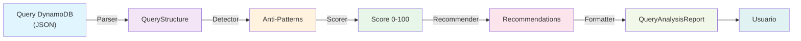
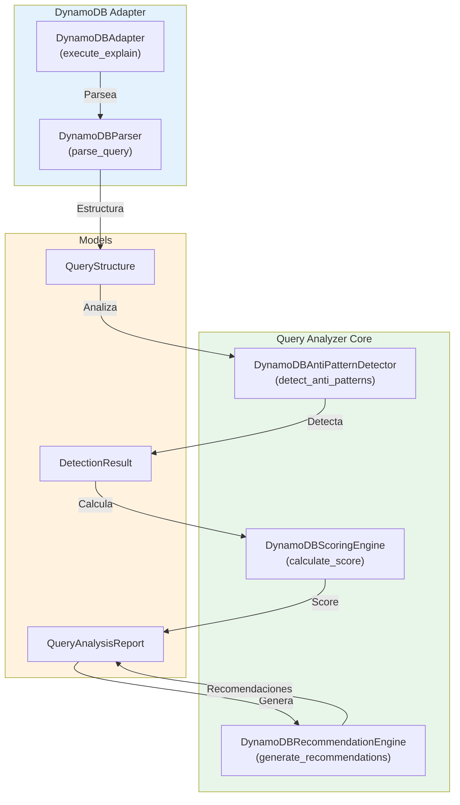
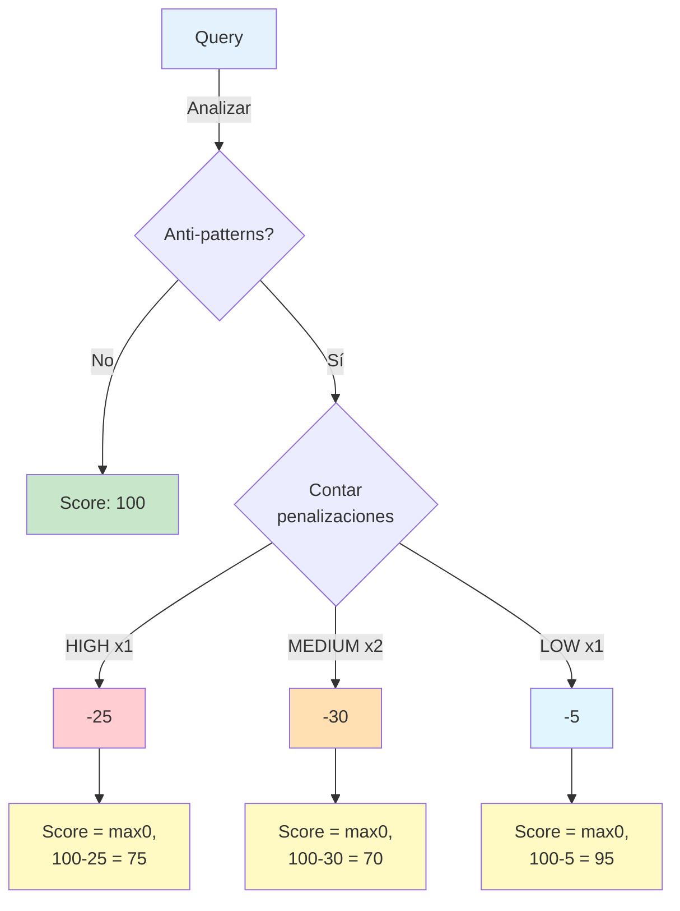

# Adapter DynamoDB - Documentación Completa

## Tabla de Contenidos

1. [Introducción](#introducción)
2. [Quick Start](#quick-start)
3. [Arquitectura](#arquitectura)
4. [Conectarse a DynamoDB](#conectarse-a-dynamodb)
5. [Los 8 Anti-Patterns](#los-8-anti-patterns)
6. [Sistema de Scoring](#sistema-de-scoring)
7. [Interpretación de Resultados](#interpretación-de-resultados)
8. [Referencia API](#referencia-api)
9. [Troubleshooting](#troubleshooting)

---

## Introducción

El adapter DynamoDB del Query Analyzer proporciona análisis profundo de queries y detección automática de anti-patterns que impactan el rendimiento y los costos de RCU/WCU (Read/Write Capacity Units).

**Capacidades principales:**
- Detección de 8 anti-patterns específicos de DynamoDB
- Sistema de scoring 0-100 con justificación contextual
- Recomendaciones accionables para cada anti-pattern
- Métricas detalladas de RCU/WCU proyectadas
- Análisis de índices secundarios (GSI/LSI)

---

## Quick Start

### 1. Instalación de Dependencias

```bash
uv sync  # Instala boto3 y moto automáticamente
```

### 2. Configuración Básica

```python
from query_analyzer.adapters.models import ConnectionConfig
from query_analyzer.adapters.registry import AdapterRegistry

# Para DynamoDB local (desarrollo)
config = ConnectionConfig(
    engine="dynamodb",
    host="http://localhost:8000",
    region="us-east-1",
    aws_access_key_id="local",
    aws_secret_access_key="local",
)

# Para DynamoDB en AWS (producción)
config = ConnectionConfig(
    engine="dynamodb",
    region="us-east-1",
    # Usa credentials del entorno (AWS_ACCESS_KEY_ID, AWS_SECRET_ACCESS_KEY)
)

adapter = AdapterRegistry.create("dynamodb", config)
```

### 3. Analizar una Query

```python
query = {
    "TableName": "Users",
    "KeyConditionExpression": "userId = :id",
    "ExpressionAttributeValues": {":id": {"S": "user123"}},
    "ProjectionExpression": "userId,userName,email",
    "Limit": 10,
}

report = adapter.execute_explain(query)
print(f"Score: {report.score}/100")
for warning in report.warnings:
    print(f"⚠️ {warning.title}: {warning.details}")
```

---

## Arquitectura

### Flujo General



### Componentes Principales



---

## Conectarse a DynamoDB

### Opción 1: DynamoDB Local (Desarrollo)

Ideal para testing local sin costos de AWS.

```bash
# Descargar y ejecutar DynamoDB local
# Opción A: Con Docker (recomendado)
docker run -d -p 8000:8000 amazon/dynamodb-local

# Opción B: Descargar JAR desde AWS
# https://docs.aws.amazon.com/amazondynamodb/latest/developerguide/DynamoDBLocal.DownloadingAndRunning.html
```

**Conexión:**
```python
config = ConnectionConfig(
    engine="dynamodb",
    host="http://localhost:8000",
    region="us-east-1",
    aws_access_key_id="local",
    aws_secret_access_key="local",
)
```

### Opción 2: DynamoDB en AWS (Producción)

Usa credenciales de AWS desde el entorno.

```python
config = ConnectionConfig(
    engine="dynamodb",
    region="us-east-1",
    # Lee AWS_ACCESS_KEY_ID y AWS_SECRET_ACCESS_KEY del entorno
)
```

**Variables de entorno (.env):**
```env
AWS_ACCESS_KEY_ID=AKIA...
AWS_SECRET_ACCESS_KEY=...
AWS_REGION=us-east-1
```

### Opción 3: Con Moto (Testing)

Simula DynamoDB completamente en memoria para tests.

```python
from moto import mock_dynamodb
import boto3

@mock_dynamodb
def test_query():
    # DynamoDB simulado en memoria
    dynamodb = boto3.resource("dynamodb", region_name="us-east-1")
    table = dynamodb.create_table(
        TableName="Users",
        KeySchema=[{"AttributeName": "userId", "KeyType": "HASH"}],
        AttributeDefinitions=[{"AttributeName": "userId", "AttributeType": "S"}],
        BillingMode="PAY_PER_REQUEST",
    )
    # ... tests ...
```

---

## Los 8 Anti-Patterns

### 1️⃣ Full Table Scan (Scan vs Query)

**Problema:**
Usar `Scan` en lugar de `Query` cuando tienes una partition key disponible. Scan lee TODOS los items de la tabla (en el peor caso), consumiendo mucha capacidad.

**Impacto:** -25 puntos | HIGH severity | ~100% más RCU

**Detección:**
```python
# ❌ ANTI-PATTERN: Scan sin partition key
query = {
    "TableName": "Users",
    "FilterExpression": "userName = :name",  # Busca sin usar PK
    "ExpressionAttributeValues": {":name": {"S": "John"}},
}
```

**Solución:**
```python
# ✅ BUENA PRÁCTICA: Query con partition key
query = {
    "TableName": "Users",
    "KeyConditionExpression": "userId = :id",
    "ExpressionAttributeValues": {":id": {"S": "user123"}},
}
```

**Benchmark Antes/Después:**
| Métrica | Antes (Scan) | Después (Query) | Mejora |
|---------|--------------|-----------------|--------|
| Items leídos | 10,000 | 50 | -99.5% |
| RCU consumidas | 2,500 | 12 | -99.5% |
| Latencia | ~5000ms | ~50ms | -99% |
| Costo mensual* | $1,250 | $6 | -99.5% |

*Basado en 100 scans/día, $1.25 por millón de RCU

---

### 2️⃣ High RCU/WCU Consumption

**Problema:**
Query que lee demasiados items innecesarios, desperdiciando capacidad y dinero.

**Impacto:** -15 puntos | MEDIUM severity | Alto costo operativo

**Detección:**
```python
# ❌ ANTI-PATTERN: Sin Limit, lee todos los items
query = {
    "TableName": "Orders",
    "KeyConditionExpression": "customerId = :cid",
    "ExpressionAttributeValues": {":cid": {"S": "cust123"}},
    # Sin Limit -> Lee TODOS los órdenes del cliente
}
```

**Solución:**
```python
# ✅ BUENA PRÁCTICA: Con Limit para paginación
query = {
    "TableName": "Orders",
    "KeyConditionExpression": "customerId = :cid",
    "ExpressionAttributeValues": {":cid": {"S": "cust123"}},
    "Limit": 25,  # Paginación controlada
}
```

**Benchmark Antes/Después:**
| Métrica | Antes (Sin Limit) | Después (Limit 25) | Mejora |
|---------|-------------------|-------------------|--------|
| Items leídos | 5,000 | 25 | -99.5% |
| RCU consumidas | 1,250 | 6 | -99.5% |
| Costo por query | $0.00156 | $0.0000075 | -99.5% |

---

### 3️⃣ Query sin Partition Key

**Problema:**
Query sin especificar la partition key (HASH key), fuerza un scan de toda la tabla o GSI.

**Impacto:** -25 puntos | HIGH severity | Inaceptable en producción

**Detección:**
```python
# ❌ ANTI-PATTERN: Falta KeyConditionExpression con partition key
query = {
    "TableName": "Users",
    "FilterExpression": "status = :s",  # Solo Filter, sin Key Condition
    "ExpressionAttributeValues": {":s": {"S": "ACTIVE"}},
}
```

**Solución:**
```python
# ✅ BUENA PRÁCTICA: Incluir partition key en KeyConditionExpression
query = {
    "TableName": "Users",
    "KeyConditionExpression": "userId = :id AND #s = :status",
    "ExpressionAttributeNames": {"#s": "status"},
    "ExpressionAttributeValues": {
        ":id": {"S": "user123"},
        ":status": {"S": "ACTIVE"},
    },
}
```

---

### 4️⃣ Large Result Set sin LIMIT

**Problema:**
Query que retorna miles de items sin paginar, causando timeouts y alto consumo de memoria.

**Impacto:** -15 puntos | MEDIUM severity | Latencia alta

**Detección:**
```python
# ❌ ANTI-PATTERN: Espera traer 10,000 items de una vez
query = {
    "TableName": "Orders",
    "KeyConditionExpression": "customerId = :cid",
    "ExpressionAttributeValues": {":cid": {"S": "cust123"}},
    # Sin Limit
}
```

**Solución:**
```python
# ✅ BUENA PRÁCTICA: Paginar resultados
query = {
    "TableName": "Orders",
    "KeyConditionExpression": "customerId = :cid",
    "ExpressionAttributeValues": {":cid": {"S": "cust123"}},
    "Limit": 50,  # Primera página
}
# Para más resultados:
# response2 = query con ExclusiveStartKey=response1['LastEvaluatedKey']
```

---

### 5️⃣ High Scan/Read Ratio

**Problema:**
Query que lee mucho más de lo que necesita (sin Limit o Filter ineficiente).

**Impacto:** -15 puntos | MEDIUM severity | Desperdicio de capacidad

**Detección:**
```python
# ❌ ANTI-PATTERN: Ratio 100:1 (lee 100 items, devuelve 1)
query = {
    "TableName": "Users",
    "KeyConditionExpression": "status = :s",
    "FilterExpression": "lastLogin > :date",  # Filtra DESPUÉS de leer
    "ExpressionAttributeValues": {
        ":s": {"S": "ACTIVE"},
        ":date": {"N": "1704067200"},
    },
}
```

**Solución:**
```python
# ✅ BUENA PRÁCTICA: Usar índice o combinar conditions
# Si tienes GSI(status, lastLogin):
query = {
    "TableName": "Users",
    "IndexName": "status-lastLogin-index",
    "KeyConditionExpression": "status = :s AND lastLogin > :date",
    "ExpressionAttributeValues": {
        ":s": {"S": "ACTIVE"},
        ":date": {"N": "1704067200"},
    },
}
```

---

### 6️⃣ Full Attribute Projection

**Problema:**
No especificar `ProjectionExpression`, retornando TODOS los atributos cuando solo necesitas algunos.

**Impacto:** -5 puntos | LOW severity | Bandwith y costo aumentado

**Detección:**
```python
# ❌ ANTI-PATTERN: Sin ProjectionExpression (trae 500 atributos innecesarios)
query = {
    "TableName": "Products",
    "KeyConditionExpression": "productId = :id",
    "ExpressionAttributeValues": {":id": {"S": "prod123"}},
    # Sin ProjectionExpression -> Trae: id, name, description, specs, reviews, etc.
}
```

**Solución:**
```python
# ✅ BUENA PRÁCTICA: Especificar solo atributos necesarios
query = {
    "TableName": "Products",
    "KeyConditionExpression": "productId = :id",
    "ExpressionAttributeValues": {":id": {"S": "prod123"}},
    "ProjectionExpression": "productId,productName,price",  # Solo estos 3
}
```

**Benchmark Antes/Después:**
| Métrica | Antes (All) | Después (Projection) | Mejora |
|---------|------------|----------------------|--------|
| Tamaño de item | 50 KB | 2 KB | -96% |
| Ancho de banda | 50 MB | 2 MB | -96% |
| RCU consumidas* | 12,500 | 500 | -96% |
| Latencia de red | ~500ms | ~20ms | -96% |

*DynamoDB cobra 4 KB por item leído, excepto con ProjectionExpression

---

### 7️⃣ Inefficient Pagination

**Problema:**
No usar `Limit` con `ExclusiveStartKey`, o paginar incorrectamente, causando re-lecturas innecesarias.

**Impacto:** -5 puntos | LOW severity | Latencia y costo

**Detección:**
```python
# ❌ ANTI-PATTERN: Paginación manual sin ExclusiveStartKey
results = []
for offset in range(0, 10000, 25):
    query = {
        "TableName": "Orders",
        "KeyConditionExpression": "customerId = :cid",
        "ExpressionAttributeValues": {":cid": {"S": "cust123"}},
        # Sin ExclusiveStartKey -> Re-lee items previos
    }
    results.extend(response["Items"])
```

**Solución:**
```python
# ✅ BUENA PRÁCTICA: Usar ExclusiveStartKey correctamente
def paginate_query(table_name, partition_key, batch_size=25):
    response = {
        "TableName": table_name,
        "KeyConditionExpression": f"{partition_key['name']} = :pk",
        "ExpressionAttributeValues": {":pk": partition_key["value"]},
        "Limit": batch_size,
    }

    results = []
    while True:
        resp = adapter.execute_explain(response)  # O client.query()
        results.extend(resp.get("Items", []))

        if "LastEvaluatedKey" not in resp:
            break

        response["ExclusiveStartKey"] = resp["LastEvaluatedKey"]

    return results
```

---

### 8️⃣ GSI Query sin Range Key

**Problema:**
Query en un Global Secondary Index sin usar la range key, degradando a un scan dentro del índice.

**Impacto:** -10 puntos | MEDIUM severity | Menos severo que full table scan

**Detección:**
```python
# ❌ ANTI-PATTERN: GSI query sin range key
query = {
    "TableName": "Orders",
    "IndexName": "status-date-index",  # GSI con (status PK, orderDate SK)
    "KeyConditionExpression": "orderStatus = :status",  # Solo PK, sin SK
    "ExpressionAttributeValues": {":status": {"S": "SHIPPED"}},
}
```

**Solución:**
```python
# ✅ BUENA PRÁCTICA: Incluir range key en GSI query
query = {
    "TableName": "Orders",
    "IndexName": "status-date-index",
    "KeyConditionExpression": "orderStatus = :status AND orderDate > :date",
    "ExpressionAttributeValues": {
        ":status": {"S": "SHIPPED"},
        ":date": {"N": "1704067200"},  # Solo órdenes de últimos 30 días
    },
}
```

**Benchmark Antes/Después:**
| Métrica | Antes (Sin SK) | Después (Con SK) | Mejora |
|---------|----------------|-----------------|--------|
| Items escaneados | 50,000 | 5,000 | -90% |
| RCU consumidas | 12,500 | 1,250 | -90% |

---

## Sistema de Scoring

### Cálculo del Score

```
Score inicial: 100

Por cada anti-pattern detectado:
  - HIGH severity:   -25 puntos
  - MEDIUM severity: -15 puntos
  - LOW severity:    -5 puntos

Score final = máx(0, Score inicial - Penalizaciones)
```

### Interpretación de Scores

```
90-100: ✅ EXCELENTE
        Query está bien optimizada. Sin cambios urgentes.

80-89:  ⚠️  ACEPTABLE
        Tiene mejoras menores. Revisar recomendaciones.

70-79:  🔴 MEDIOCRE
        Múltiples anti-patterns. Requiere optimización.

0-69:   🚨 CRÍTICO
        Query es inaceptable en producción. Refactorizar ASAP.
```

### Diagrama de Scoring



---

## Interpretación de Resultados

### Estructura del Report

```python
report = adapter.execute_explain(query)

# Acceso a campos:
print(f"Score: {report.score}/100")                # int 0-100
print(f"Warnings: {len(report.warnings)}")          # list[Warning]
print(f"Recommendations: {len(report.recommendations)}")  # list[Recommendation]
print(f"Execution time: {report.execution_time_ms}ms")  # float
print(f"Analyzed at: {report.analyzed_at}")        # datetime
```

### Modelo Warning

```python
# Cada warning tiene:
warning.title          # str: Título corto del problema
warning.details        # str: Descripción detallada
warning.severity       # str: "HIGH", "MEDIUM", "LOW"
```

### Modelo Recommendation

```python
# Cada recomendación tiene:
rec.title              # str: Título de la recomendación
rec.details            # str: Explicación del problema
rec.action             # str: Pasos específicos para solucionarlo
rec.expected_improvement  # str: Beneficios esperados (ej: "-80% RCU")
rec.priority           # int: 1-10 (1=crítica, 10=nice-to-have)
```

### Ejemplo de Interpretación

```python
from query_analyzer.adapters.models import ConnectionConfig
from query_analyzer.adapters.registry import AdapterRegistry

config = ConnectionConfig(
    engine="dynamodb",
    host="http://localhost:8000",
    region="us-east-1",
    aws_access_key_id="local",
    aws_secret_access_key="local",
)

adapter = AdapterRegistry.create("dynamodb", config)

# Query con anti-patterns
query = {
    "TableName": "Orders",
    "FilterExpression": "orderStatus = :status",  # Anti-pattern: Scan
    "ExpressionAttributeValues": {":status": {"S": "PENDING"}},
}

report = adapter.execute_explain(query)

# Interpretación
print(f"\n📊 Score: {report.score}/100")

if report.score < 70:
    print("🚨 CRÍTICO: La query necesita refactorización urgente")
elif report.score < 80:
    print("🔴 MEDIOCRE: Revisa las recomendaciones")
else:
    print("✅ ACEPTABLE: Query bien optimizada")

# Ver qué mejorar
for i, rec in enumerate(report.recommendations, 1):
    print(f"\n{i}. [{rec.priority}/10] {rec.title}")
    print(f"   Acción: {rec.action}")
    print(f"   Mejora: {rec.expected_improvement}")
```

---

## Referencia API

### DynamoDBAdapter

```python
class DynamoDBAdapter(BaseAdapter):
    """Adapter para analizar queries de DynamoDB."""

    def connect(self) -> None:
        """Conectar a DynamoDB."""

    def disconnect(self) -> None:
        """Desconectar de DynamoDB."""

    def is_connected(self) -> bool:
        """Verificar si está conectado."""

    def execute_explain(self, query: Dict[str, Any]) -> QueryAnalysisReport:
        """Analizar una query DynamoDB.

        Args:
            query: Query en formato DynamoDB JSON

        Returns:
            QueryAnalysisReport con score, warnings, recommendations
        """
```

### QueryAnalysisReport

```python
@dataclass
class QueryAnalysisReport:
    """Reporte de análisis de query."""

    score: int                          # 0-100
    warnings: List[Warning]             # Anti-patterns detectados
    recommendations: List[Recommendation]  # Recomendaciones
    metrics: Dict[str, Any]             # Métricas (RCU, WCU, etc.)
    execution_time_ms: float            # Tiempo de análisis
    analyzed_at: datetime               # Timestamp
    raw_plan: Optional[Dict[str, Any]]  # Plan de ejecución (si aplica)
```

---

## Troubleshooting

### Error: ConnectionRefusedError

**Problema:**
```
ConnectionRefusedError: Unable to connect to DynamoDB at http://localhost:8000
```

**Soluciones:**

1. **DynamoDB local no está corriendo:**
   ```bash
   docker run -d -p 8000:8000 amazon/dynamodb-local
   # Verificar: curl http://localhost:8000
   ```

2. **Puerto 8000 en uso:**
   ```bash
   # Cambiar puerto en Docker:
   docker run -d -p 8001:8000 amazon/dynamodb-local

   # Actualizar config:
   config.host = "http://localhost:8001"
   ```

3. **Entorno de AWS no configurado:**
   ```bash
   # Para usar AWS en producción, configura:
   export AWS_ACCESS_KEY_ID=AKIA...
   export AWS_SECRET_ACCESS_KEY=...
   export AWS_REGION=us-east-1
   ```

### Error: ValidationException

**Problema:**
```
ValidationException: One or more parameter values were invalid: An AttributeValue may not contain an empty string
```

**Solución:**
DynamoDB no permite strings vacíos. Validar valores:
```python
query = {
    "TableName": "Users",
    "ExpressionAttributeValues": {
        ":name": {"S": "John"}  # No puede ser vacío ("")
    }
}
```

### Error: ResourceNotFoundException

**Problema:**
```
ResourceNotFoundException: Requested resource not found
```

**Solución:**
La tabla no existe. Verificar:
```python
# Crear tabla en DynamoDB local:
dynamodb = boto3.resource("dynamodb", endpoint_url="http://localhost:8000")
table = dynamodb.create_table(
    TableName="Users",
    KeySchema=[{"AttributeName": "userId", "KeyType": "HASH"}],
    AttributeDefinitions=[{"AttributeName": "userId", "AttributeType": "S"}],
    BillingMode="PAY_PER_REQUEST",
)
```

### Query retorna score 100 pero esperaba warnings

**Verificar:**
1. ¿La query usa Query + ProjectionExpression + Limit?
2. ¿Incluye partition key en KeyConditionExpression?
3. ¿No hay Scan explícito?

Si todas son "sí", la query está correctamente optimizada ✅

---

## FAQ

**P: ¿Cuál es la diferencia entre Query y Scan?**

R: Query busca items específicos usando la partition key (+ opcionalmente sort key). Scan lee TODOS los items. Query es ~100 veces más eficiente.

**P: ¿Cómo interpreto "mejora esperada -80% RCU"?**

R: Si estás consumiendo 100 RCU actualmente, al aplicar la recomendación bajarías a 20 RCU. Reduce costos un 80%.

**P: ¿Puedo ignorar warnings con score < 85?**

R: No recomendado en producción. Cada warning representa dinero desperdiciado o riesgo de throttling.

**P: ¿Funciona con DynamoDB Streams?**

R: No. El analyzer solo examina operaciones Query/Scan, no Streams o replicación.

**P: ¿Y con Global Tables?**

R: Sí. Analiza queries exactamente igual. Las recomendaciones aplican a todas las réplicas.

---

## Contribuciones

Reportar bugs o sugerir mejoras en: https://github.com/UPT-FAING-EPIS/proyecto-si783-2026-i-u1-analizador-de-rendimiento-de-consultas/issues

---

**Última actualización:** Abril 2026
**Versión:** 1.0.0
**Autor:** Query Analyzer Team
